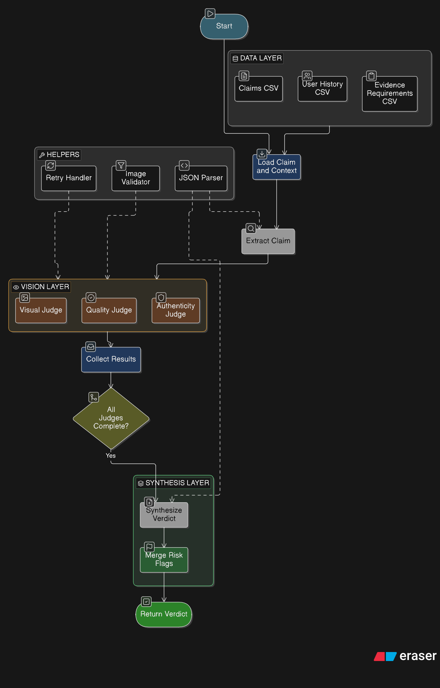

# Multi-Modal Evidence Review — HackerRank Orchestrate

A multi-agent system that verifies visual evidence for damage claims across **cars**, **laptops**, and **packages**. Built with CrewAI Flows and a dual-model architecture using local Ollama instances.



Read [`problem_statement.md`](./problem_statement.md) for the full task spec, input/output schema, and allowed values.

---

## Quick Start

```bash
git clone <repo-url>
cd hackerrank-orchestrate-june26

# Create virtual environment
python3.12 -m venv venv
source venv/bin/activate

# Install dependencies
pip install crewai crewai-tools pyyaml python-dotenv requests

# Configure .env (see Setup section below)
cp .env.example .env  # or create manually

# Run the system
python code/main.py
```

Produces `output.csv` in the repo root.

---

## Setup

### Prerequisites

- Python 3.12 (Python 3.14 is incompatible with CrewAI dependencies)
- [Ollama](https://ollama.ai) running locally
- ~8 GB RAM for running both models concurrently

### Ollama Configuration

Two Ollama instances run in parallel on different ports:

| Instance | Port | Model | Purpose |
|----------|------|-------|---------|
| Primary | `11434` | `gemma4:31b-cloud` | Vision analysis (images) |
| Secondary | `11435` | `gemma3:27b-cloud` | Text processing (extraction, synthesis) |

Start the second instance in a separate terminal:

```bash
OLLAMA_HOST=127.0.0.1:11435 ollama serve
```

Pull the required models:

```bash
ollama pull gemma4:31b-cloud
ollama pull gemma3:27b-cloud
```

### Environment Variables (`.env`)

```env
# Ollama endpoints
OLLAMA_MODEL_GEMMA4_URL=http://127.0.0.1:11434
OLLAMA_MODEL_GEMMA3_URL=http://127.0.0.1:11435

# Text agents — Gemma3 (port 11435)
MODEL_CLAIM_EXTRACTOR=ollama/gemma3:27b-cloud
MODEL_SYNTHESIZER=ollama/gemma3:27b-cloud

# Vision agents — Gemma4 (port 11434)
MODEL_VISUAL_JUDGE=ollama/gemma4:31b-cloud
MODEL_QUALITY_JUDGE=ollama/gemma4:31b-cloud

# Cross-check agent — Gemma3 (different model for jury diversity)
MODEL_AUTHENTICITY_JUDGE=ollama/gemma3:27b-cloud
```

### Running

```bash
source venv/bin/activate
python code/main.py
```

For evaluation on sample data:

```bash
python code/evaluation/main.py --max-rows 20
```

---

## Approach

### Problem

Given a claim conversation, submitted images, user history, and evidence requirements, determine whether the images support, contradict, or fail to prove the damage claim.

### Architecture: Parallel Jury with Synthesis

The system uses a **3-phase pipeline** orchestrated by CrewAI Flows:

```
Phase 1: Claim Extraction (Gemma3 — text-only)
    Parse conversation → issue_type, object_part, claim_description
                        │
         ┌──────────────┼──────────────┐
         ▼              ▼              ▼
   ┌───────────┐  ┌───────────┐  ┌───────────────┐
   │  Visual   │  │  Quality  │  │ Authenticity  │
   │  Judge    │  │  Judge    │  │    Judge      │
   │ (Gemma4)  │  │ (Gemma4)  │  │  (Gemma3)     │
   │           │  │           │  │               │
   │ Analyze   │  │ Check     │  │ Cross-check   │
   │ images    │  │ image     │  │ for           │
   │ for       │  │ quality   │  │ manipulation  │
   │ damage    │  │ & validity│  │ & mismatches  │
   └─────┬─────┘  └─────┬─────┘  └───────┬───────┘
         │              │                 │
         └──────────────┼─────────────────┘
                        │  and_() gate (waits for all 3)
                        ▼
Phase 3: Synthesis (Gemma3 — text-only)
    Merge all jury outputs → final verdict
    Aggregate risk_flags from all judges
```

### Why Two Models?

| Model | Role | Rationale |
|-------|------|-----------|
| **Gemma4 31b** | Visual judges | Vision-capable, analyzes submitted images for damage evidence |
| **Gemma3 27b** | Extraction, synthesis, authenticity cross-check | Text-only, provides independent "second opinion" to reduce correlated errors |

The **authenticity judge** uses a different model than the visual judges. This adds **jury diversity** — it cross-checks the vision model's findings independently, reducing the chance of systematic bias from a single model.

### Key Design Decisions

1. **Direct Ollama API for vision** — CrewAI's Ollama provider routes through an OpenAI-compatible endpoint that doesn't support image input. Vision agents call Ollama's native `/api/chat` endpoint directly with base64-encoded images.

2. **`_JudgeCollector` pattern** — CrewAI Flows clones Pydantic state per-method during async execution. A thread-safe module-level collector (`flow_id` → `{key: value}`) bypasses this state isolation so the synthesis step can read outputs from parallel vision judges.

3. **Magic-byte image filtering** — Many `.jpg` files in the dataset are actually MP4/RIFF video containers that Ollama rejects. `_is_valid_image()` checks for JPEG (`ff d8`) or PNG (`89 50 4e 47`) file headers before sending.

4. **Retry with exponential backoff** — Transient Ollama errors are retried up to 2 times with exponential backoff.

5. **Prompt injection defense** — The authenticity judge detects instruction-like text in claims (e.g., "ignore all previous instructions") and flags `text_instruction_present` in risk_flags.

### Evaluation Results

Tested on `dataset/sample_claims.csv` (20 labeled rows):

| Field | Accuracy |
|-------|----------|
| object_part | 85% |
| evidence_standard_met | 75% |
| claim_status | 65% |
| issue_type | 50% |
| valid_image | 45% |
| severity | 40% |
| **Overall** | **60%** |

Runtime: ~550s for 20 rows (~27.5s/row).

---

## Repository Layout

```
.
├── AGENTS.md                         # AI coding tool rules + transcript logging
├── problem_statement.md              # Full task description and I/O schema
├── README.md                         # You are here
├── .env                              # Model endpoints and API keys (not committed)
├── code/
│   ├── main.py                       # Batch runner entry point
│   ├── config.py                     # Loads .env + YAML, resolves model URLs
│   ├── config/
│   │   ├── agents.yaml               # Agent definitions (role, goal, model)
│   │   └── tasks.yaml                # Task definitions with structured prompts
│   ├── data/
│   │   ├── loader.py                 # CSV loading, ClaimRow/ClaimContext dataclasses
│   │   └── writer.py                 # output.csv writer (exact 14-column schema)
│   ├── crews/
│   │   └── jury_crew.py              # ClaimReviewFlow + helpers + run_pipeline()
│   └── evaluation/
│       ├── main.py                   # Evaluation entry point
│       ├── eval_results.json         # Per-field accuracy metrics
│       └── report.md                 # Human-readable eval report
├── output.csv                        # Generated predictions (44 rows)
└── dataset/
    ├── sample_claims.csv             # Labeled examples for dev/eval
    ├── claims.csv                    # Input-only rows (final submission)
    ├── user_history.csv              # Historical claim data
    ├── evidence_requirements.csv     # Minimum evidence rules
    └── images/
        ├── sample/                   # Images for sample_claims.csv
        └── test/                     # Images for claims.csv
```

---

## Submission

1. **Code zip**:
   ```bash
   zip -r code.zip code/ README.md problem_statement.md AGENTS.md
   ```
2. **Predictions CSV**: `output.csv` (44 rows, one per claim in `claims.csv`)
3. **Chat transcript**: `$HOME/hackerrank_orchestrate/log.txt`

Before submitting, verify:
- `output.csv` has exactly 44 data rows + 1 header
- Columns match the exact schema in `problem_statement.md`
- Evaluation files are included in `code.zip`
